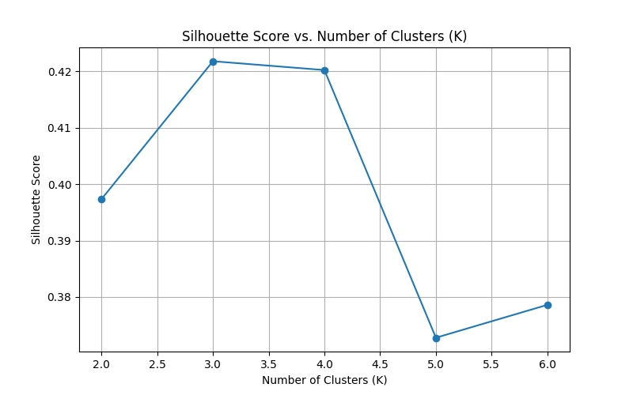

# distance_classification

#### 1. What are the common distance metrics used in distance-based classification algorithms? 
**Answer:** Common distance metrices are:
1. Euclidean Distance
2. Manhattan Distance
3. Minkowski Distance
4. Chebyshev Distance
5. Cosine Similarity
   
#### 2. What are some real-world applications of distance-based classification algorithms? 
**Answer:** Real world applications are:
1. Image Recognition: Identifying objects in images based on their pixel similarities.
2. Recommendation Systems: Identifying similar users or items based on past interactions (e.g., movie or product recommendations).
3. Medical Diagnosis: Classifying diseases based on patient symptoms (e.g., diabetes classification).
4. Anomaly Detection: Detecting fraudulent transactions in finance by checking deviations from normal behavior. 

#### 3. Explain various distance metrics. 
**Answer:**
1. Eucleadian distance : Measures the straight-line distance between two points in an n-dimensional space.
2. Manhattan Distance : Measures distance along axes at right angles (like a city grid).
3. Minkowski Distance : Generalized version of Euclidean and Manhattan
4. Chebyshev Distance : Considers only the maximum absolute difference in any dimension
5. Cosine Similarity : Measures the angle between two vectors rather than absolute distance

#### 4. What is the role of cross validation in model performance? 
**Answer:** Role of cross validation in model performance:
Cross-validation is used to assess and improve the generalization ability of a model by splitting the dataset into training and validation sets multiple times.

- Helps Prevent Overfitting: Ensures the model is not memorizing the training data.
- Provides a More Reliable Performance Estimate: Reduces the impact of data randomness on evaluation.
- Optimizes Hyperparameters: Can be used to select the best number of neighbors (K) in KNN

#### 5. Explain variance and bias in terms of KNN? 
**Answer:**
- Bias:
Bias is how much the model simplifies the data.
High Bias (Underfitting) occurs when KNN uses a very large value of K (e.g., K is close to the dataset size), leading to oversmoothing and missing important patterns.
- Variance:
Variance is how much the model's predictions fluctuate with different data samples.
High Variance (Overfitting) occurs when K is too small (e.g., K=1), causing the model to memorize the training data and perform poorly on unseen data.